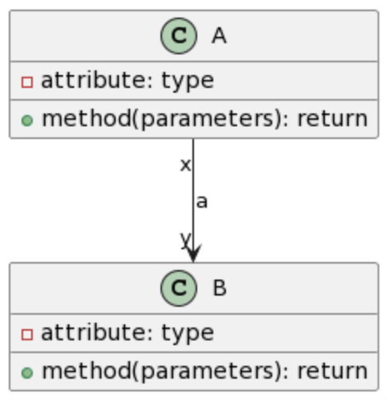

# Introduction

<!--  -->

In this activity you will practice generating UML class diagrams using an online tool called [PlantUML](https://www.plantuml.com/). You can use the online tool or setup [PlantUML's VS Code extension](https://marketplace.visualstudio.com/). There is a [PlantUML Guide](https://plantuml.com/guide) too.

# PlantUML Cheat Sheet

```
class A {
    - attribute: type
    + method(parameters): return
}

class B {
    - attribute: type
    + method(parameters): return
}

A  <|-- B
```


```
interface I {
  +method(parameters): return
}

I <|.. A
```


```
A "x" --> "y" B : a
```



```
A "x" o--> "y" B : aggregation
```


```
A "x" *--> "y" B : composition
```


# Employees, Departments, and Dependents

Draw an UML Class Diagram to represent:​

- a department has a name and a location;
- an employee has an id (numeric), name, and email;

- employees work at one department at a time, while a department can (potentially) have many employees​; ✅

- a department might exist without an employee working at it; ✅

- an employee might exist without working at a department; ✅

- employees can have family members listed as dependents (for health benefits)​;
- each dependent is associated with only employee;

- rel: 1 to many

- an employee might not have dependents;

- a dependent cannot exist without being associated with an employee. Composition

# Sales, Items, and Sellers

Draw an UML Class Diagram to represent:​

- a sale is made of many items and the same item can appear on many different sales​;
- a sale is done by only one seller;
- a seller can do many sales​.

# Courses, Sections, Students, and Instructors

Draw an UML Class Diagram to represent:​

- a course can have many sections​;✅

- a section is always associated with one course and cannot exist without a course; ✅

- each section can have many students and each student can enroll in many different course sections​; ✅

- a course section is taught by only one instructor​;

- a instructor can teach many course sections.
