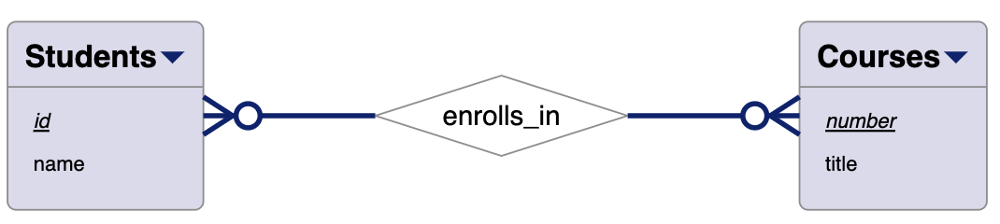
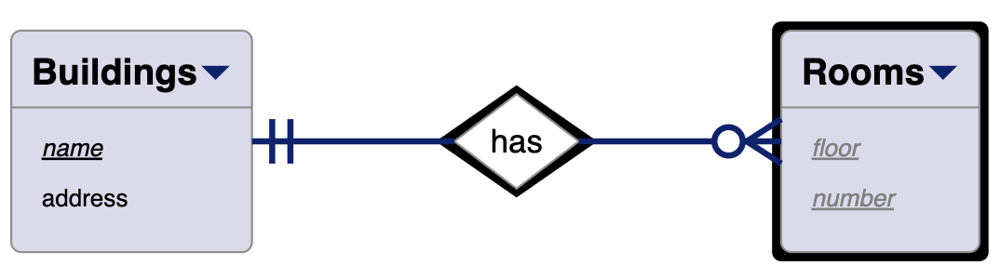
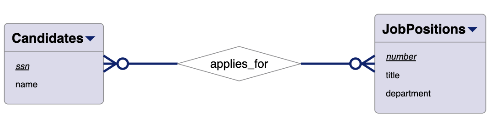
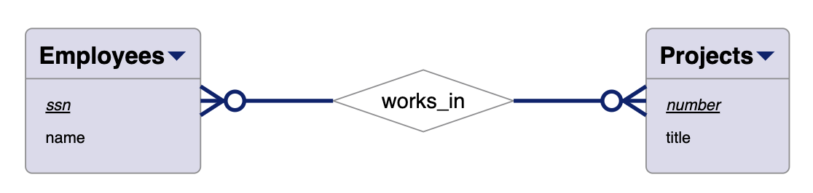
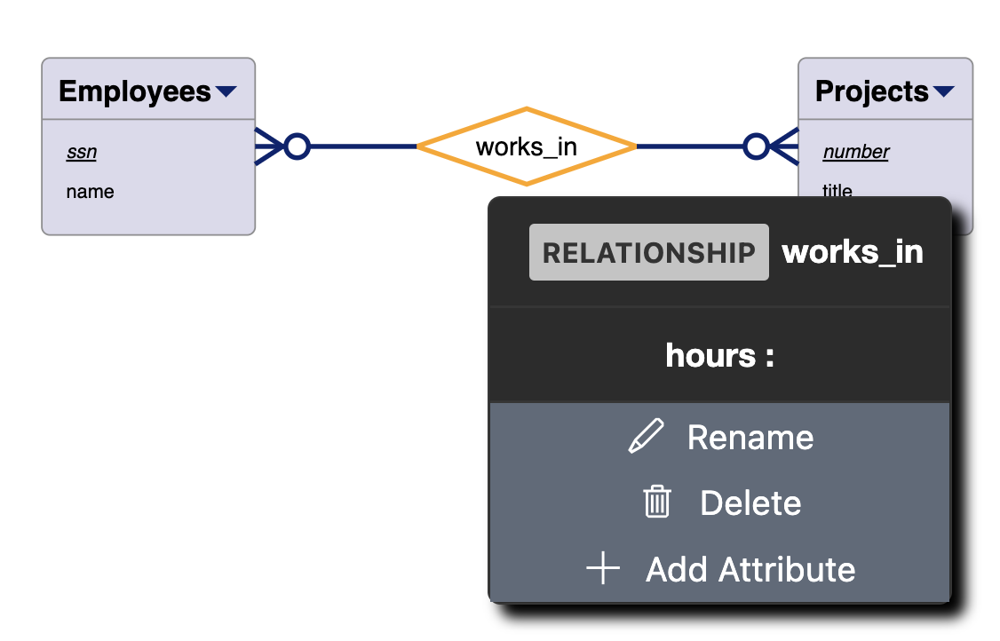
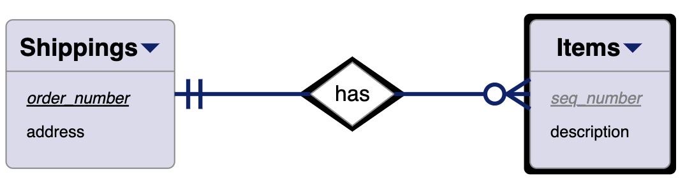

Derive a relational model from each of the ERDs below.

## Practice #1 ✅

<!--  -->

```
erdiagram courses
notation=crowsfoot

entity Students {
    id key
    name
}

entity Courses {
    number key
    title
}

relationship enrolls_in {
    Students[0..N] -> Courses[0..N]
}
```

# Practice #1 Solution ✅

```
Students(id*: int, name: string) ✅
Courses(number*: int, title: string) ✅
Enrollments(id*: int, number*: int) ✅


------------------------------------
-SIDE NOTE- Possible attributes you could include for the relationship:
    -- grade: string
    -- date_enrolled: date
    -- instructor: string
    -- department: string

```



## Practice #2 ✅

```
erdiagram buildings
notation=crowsfoot

entity Buildings {
    name key
    address
}

weak entity Rooms {
    floor partial-key
    number partial-key
}

weak relationship has {
    Buildings[1] -> Rooms[0..N]
}

```

# Practice #2 Solution ✅

```
Buildings(name*: string, address: string) ✅
Rooms(floor*: int, number*: int, name*: string) ✅
Has(name*: string, floor*: int, number*: int) ✅

```



## Practice #3 ✅

```
erdiagram candidates
notation=crowsfoot

entity Candidates {
    ssn key
    name
}

entity JobPositions {
    number key
    title
    department
}

relationship applies_for {
    Candidates[0..N] -> JobPositions[0..N]
}
```

# Practice #3 Solution ✅

### NOTE: The data type will not be considered as much for homework assignments.

```
Candidates(ssn*: int, name: string) ✅
JobPositions(number*: int, title: string, department: string) ✅
Applicants(ssn*: int, number*: int) ✅


------------------------------------
-SIDE NOTE- Possible attributes you could include for the relationship:
    -- date_applied: date
    -- status: string
    -- job_title: string
    -- department: string

```



## Practice #4 ✅

```

erdiagram buildings
notation=crowsfoot

entity Employees {
ssn key
name
}

entity Projects {
number key
title
}

relationship works_in {
Employees[0..N] -> Projects[0..N]
hours
}

```

# Practice #4 Solution

```
Employees(ssn*: int, name: string) ✅
Projects(number*: int, title: string) ✅

-SIDE NOTE- When determining a name just combine the names (use when you cannot think of a name)

EmployeeProjects(ssn*: int, number*: int, hours: int)
```





## Practice #5 ✅

```$$

erdiagram shippings
notation=crowsfoot

entity Shippings {
order_number key
address
}

weak entity Items {
seq_number partial-key
description
}

weak relationship has {
Shippings[1] -> Items[0..N]
}

```

# Practice #5 Solution

```
Shippings(order_number*: int, address: string)
Items(seq_number*: int, description: string, order_number*: int)
Has(order_number*: int, seq_number*: int)

```

```
// Always move from the weak entity to the strong entity & 1 to many.
// Only case when 1 to many -> Move from 1 side to many (prime attributes from one relationship to the next).
```


