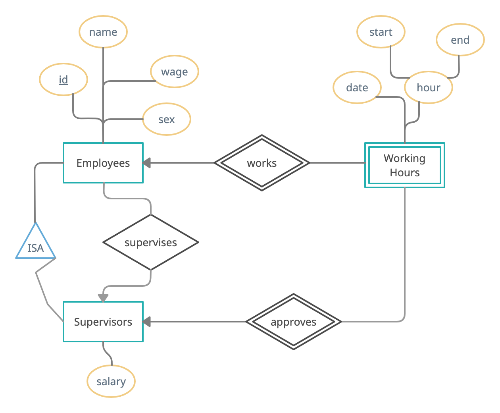

Study carefully the conceptual data model for an “employee time tracking system” illustrated by the E/R diagram below (in Chen's notation).

An employee is uniquely identified by a number (the “id” attribute). For each employee, the system stores the employee’s name, sex (0: not known, 1: male, 2: female, 3: not applicable), and hourly wage. Some employees are supervisors and are not paid by the hour. Those employees earn a fixed salary instead. A supervisor can (potentially) supervise many employees. An employee can have up to one (designated) supervisor. Employees that are supervisors do not have a supervisor.

Wage-paid employees have to register their working hours in the system by entering the date when they worked, starting and ending hours. All registered working hours need to be approved by the employee’s (designated) supervisor in order to be eligible for payment. Because supervisors change from time to time, the system needs to maintain (for auditing purposes) the information about which supervisor approved which hours.

<!--  -->

## Part A: Relational Model

Your first task in this activity is to derive a Relational Model from the conceptual E/R Model detailed in the previous section. Use the techniques described in the textbook (section 4.5, pages 157-165) and discussed in class to determine how to create relations from the entity sets and relationships of a given E/R Model. Write your model as a relational schema identifying each relation, their attributes, attribute domains, and primary keys. Any attribute domain that is not primitive (integer, floating-point, text, char, boolean, date, or time) must be explicitly defined in your solution.

Employees(id*: int, name: String, sex: int, wage: float, sup_id: int) ✅
Supervisors(id*: int, salary: float) ✅
Hours(id*: int, date*: date, start\*: time, end: time, approved: boolean, employee_id: int, sup_id: int) ✅

## Part B: Relational Algebra

Use relational algebra to answer the queries listed in this section. To reduce repetitive work, you can use := to create useful temporary relations (see section 2.4.13, page 51 of the textbook). For example, let’s say you are constantly having to join relations A and B to answer different queries. You can assign the natural join of A and B to C using C := A ⋈ B and then reuse C.

a) List all male employees.

σEmployees sex=1 ✅

b) List the names of all female employees.

πname(σEmployees sex=2) ✅

c) List the name and salary of employees that are supervisors.

π name, salary(Employees ⋈ Supervisors) ✅

d) List all employees that are supervised by “Mary”.

// Employees ⋈ Supervisors -> this part gives the name of the supervisor.

Employees ⋈ (Employees ⋈ Supervisors) // This part gives the name of the employee.
A.sup_id = B.id AND B.name = "Mary" // Filters by the name of the supervisor. ✅

e) List the hours entered by “Janet” for the hours she worked on September 15, 2020.

// Identify the employee id for Janet - From the Employees and Hours Relation. Projection of the employee id and the date of the hours
π (Employees ⋈ Hours // Join Employees and Hours
id = employee_id AND name = "Janet" // Filter by the name of the employee
date = "September 15, 2020" // Filter by the date
) ✅

f) List the name of all employees that have non-approved hours for the month of September.

// Sup_id is the supervisor id that will approve the hours
π name (Employees ⋈ Hours
sup_id is NULL // This means that the employee is a supervisor
AND
dates month is September // This means that the hours are from September
) ✅

g) List the names of all supervisors that earn more than $65K.

π name(σ salary > 65000 (Employees ⋈ Supervisors)) ✅

// Check Notes

h) List all wage-paid employees that do not have a (designated) supervisor.

// Left-Semi Join - Employees that are not supervisors
σ(Employees)
wage NOT NULL AND sup_id is NULL // Filter by the wage and the supervisor id ✅

i) List all supervisors that are not supervising any employee.

// Left-Semi Join - Employees that are supervisors
Check Digital Notes

j) List the name of each wage-paid employee followed by its supervisor’s name and the employee’s hours (date, start, and end) entered for the month of September. For each hour displayed, show whether the hour has been approved or not.

// Need working hours, supervisor name, and employee name
// Check Notes
