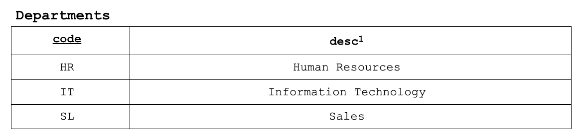
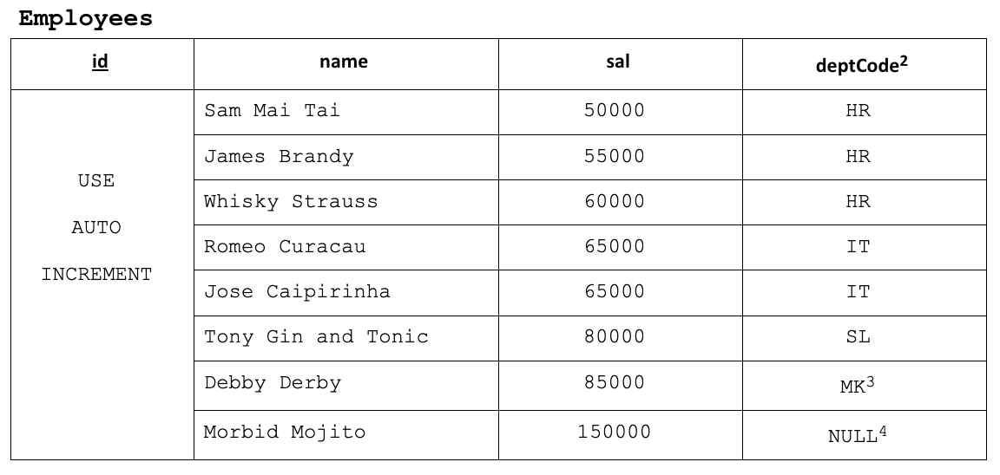

# Instructions

The goal of this activity is to practice joins using SQL. You should use employees as the name of your database. Save all of your SQL statements in a text file named **employees.sql**. Use the provided template.

Create the following tables, populating them with the exact given data.

1. desc is a reserved word so you need to enclose it in backticks (MySQL) or double quotes (Postgres) in order to use this name as an attribute in a table.
<!--  -->

2. Attribute “deptCode” in Employees should be defined with the foreign key constraint.

3. You will first try ‘MK’ as in ‘Marketing’ but because of the referential integrity constraint you should get an error.  After “seeing and believing” replace ‘Mk’ with ‘SL’.

4. Use NULL so you can see that the referential integrity constraint will not check NULL values.

Finish the queries embedded as to-do's in the SQL script.
