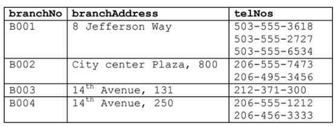
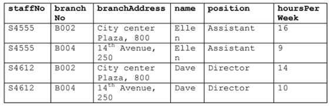
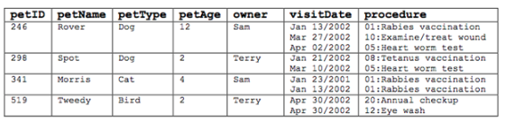
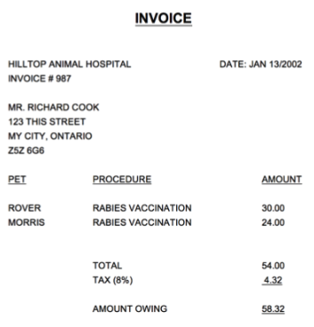
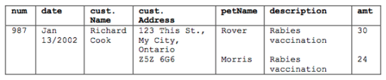

# Example 1

<!--  -->

Consider the following relation to answer the questions that follows.



a) The relation is NOT in 1NF. Why?
• NO, because attribute "telNos" is a multi-valued attribute.

b) Normalize the relation to 1NF.

| brandNo | branchAddress     | telNos       |
| ------- | ----------------- | ------------ |
| B001    | 8 Jefferson Way   | 503-555-3618 |
| B001    | 8 Jefferson Way   | 503-555-2727 |
| B001    | 8 Jefferson Way   | 503-555-6534 |
| B002    | City Center Plaza | 206-555-7473 |
| B002    | City Center Plaza | 206-495-3456 |
| B003    | 14th Avenue, 131  | 212-371-3000 |
| B004    | 14th Avenue, 250  | 206-555-1212 |
| B004    | 14th Avenue, 250  | 206-456-3333 |

# Example 2

Consider the following relation to answer the questions that follows.



a) The relation is NOT in 2NF. Why?

 <!-- 
    2NF: A relation is in 2NF if it is in 1NF and every non-key attribute is fully functionally dependent on the primary key.
    1NF: A relation is in 1NF if it contains no repeating groups.
  -->

```sql
{staffNo, brandNo} is a key
staffNo -> name
staffNo -> position
branchNo -> branchAddress
{staffNo, branchNo} -> hoursPerWeek
```

There is a 2NF violation as name and position partially depend on the key; as well as branchAddress.

b) Normalize the relation to 2NF, showing the (partial) functional dependencies to the key.

<!-- Relational Model -->

```sql
Staff(staffNo*, name, position)
Branches(branchNo*, branchAddress)
StaffBranch(staffNo*, branchNo*, hoursPerWeek)
```

# Example 3

Consider the following relation to answer the questions that follows.



a) Normalize the relation to 1NF.

| petId | petName | petType | petAge | owner | visitDate   | proCode | proDesc             |
| ----- | ------- | ------- | ------ | ----- | ----------- | ------- | ------------------- |
| 246   | Rover   | Dog     | 12     | Sam   | Jan 13/2002 | 01      | Rabies Vaccination  |
| 246   | Rover   | Dog     | 12     | Sam   | Jan 13/2002 | 10      | Examine/Treat Wound |
| 246   | Rover   | Dog     | 12     | Sam   | Jan 13/2002 | 05      | Heart Worm Test     |
| 298   | Spot    | Dog     | 2      | Terry | Jan 21/2002 | 08      | Tetanus Vaccination |
| 298   | Spot    | Dog     | 2      | Terry | Jan 21/2002 | 05      | Heart Worm Test     |
| 341   | Morris  | Cat     | 4      | Sam   | Jan 23/2001 | 01      | Rabies Vaccination  |
| 341   | Morris  | Cat     | 4      | Sam   | Jan 23/2001 | 01      | Rabies Vaccination  |
| 519   | Tweedy  | Bird    | 2      | Terry | Apr 30/2002 | 20      | Annual Checkup      |
| 519   | Tweedy  | Bird    | 2      | Terry | Apr 30/2002 | 12      | Eye Wash            |

b) Normalize the relation to 2NF.

• Can the same pet have more than one procedure on the same day? If so, what is the key? ✅ (From Homework 07)

```sql
{petId, visitDate, proCode} is a key
petId -> petName, petType, petAge, owner
proCode -> proDesc

<!-- For partial dependecies create a relation to represent that -->

Pets(petId*, petName, petType, petAge, owner)
Procedures(proCode*, proDesc)
PetVisits(petId*, visitDate*, proCode\*)
```

<!--  -->

# Example 4

Consider the following invoice.



From the invoice, we can derive the following unnormalized (UNF) relation:



Normalize the invoice relation to 3NF. Assume, based on the previous exercise, that each pet can be uniquely identified by an ID and that each procedure also has an unique ID. Also, consider adding an ID to uniquely identify a customer, pet and procedure.

| num | date        | cust. Name   | street       | city    | state   | zip     | petName | desc               | amt |
| --- | ----------- | ------------ | ------------ | ------- | ------- | ------- | ------- | ------------------ | --- |
| 987 | Jan 13/2002 | Richard Cook | 123 This St. | My City | Ontario | z5z 6gg | Rover   | Rabies Vaccination | 30  |
| 987 | Jan 13/2002 | Richard Cook | 123 This St. | My City | Ontario | z5z 6gg | Morris  | Rabies Vaccination | 24  |

2NF
-- This is to normalize the relation to 1NF and then to 2NF. The relation is already in 1NF.

```
key is {num, petName, description}
num -> date, custName, custAddr, custCity, custState, custZip
```

After 2NF

```
Invoices(num*, date, custName, custAddr, custCity, custState, custZip)
InvoiceDetails(num*, petName, description)
```

3NF

-- The customer information is dependent on the customer name, so we need to create a new relation for the customer information.

```
custName -> custAddr, custCity, custState, custZip
```

After 3NF - Normalized up to the third normal form.

```
Customers(custName*, custAddr, custCity, custState, custZip)
Invoices(num*, date, custAddr, custCity, custState, custZip)
InvoiceDetails(num*, petName, description)
```
