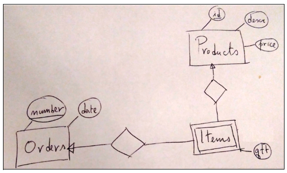

# Instructions

Consider the E/R model below.



Create a relational database system named orders that matches the given E/R model. Create a check for the price so not to allow negative values. Add the following Products, making sure the “id” for the table is auto-incremented.

```
 id |      descr       | price
----+------------------+--------
  1 | Ninja Sword      | 250.00
  2 | Dummy            |  50.00
  3 | Fake Blood       |   5.00
  4 | Rubber Ducky     |   1.00
  5 | Bathtub Soap     |   3.00
  6 | Brazilian Coffee |   5.00
  7 | Running Shoes    |  50.00
```

Then add the following Orders:

```
 number |    date
--------+------------
    101 | 2020-09-12
    202 | 2021-09-27
    303 | 2021-09-30
    404 | 2021-10-12
```

Create the table Items, making sure to also create a trigger that ensures that column “qtt” is automatically set to 1 IF the value entered is less than or equal 0. The trigger must be set before populating the table!

Try to run the following inserts AFTER your trigger is created (note that some of the inserts should "trigger" the trigger).

```
INSERT INTO Items VALUES (101, 1, -1);  -- trigger!
INSERT INTO Items VALUES (101, 2, 10);
INSERT INTO Items VALUES (101, 3, 5);
INSERT INTO Items VALUES (202, 4, 200);
INSERT INTO Items VALUES (202, 6, 10);
INSERT INTO Items VALUES (303, 7, 0); -- trigger!
INSERT INTO Items VALUES (303, 1, 10);
INSERT INTO Items VALUES (404, 4, 1);
INSERT INTO Items VALUES (404, 7, 3);
```

After the inserts your table Items should look like the following:

```
 order | item | qtt
-------+------+-----
   101 |    1 |   1
   101 |    2 |  10
   101 |    3 |   5
   202 |    4 | 200
   202 |    6 |  10
   303 |    7 |   1
   303 |    1 |  10
   404 |    4 |   1
   404 |    7 |   3
```

Finally, create the following views:

View 1: OrdersTotalByMonth

```
 year | month |  total
------+-------+---------
 2020 |     9 |  775.00
 2021 |     9 | 2800.00
 2021 |    10 |  151.00
```

View 2: OrdersTotalByYear

```
 year |  total
------+---------
 2020 |  775.00
 2021 | 2951.00
```
