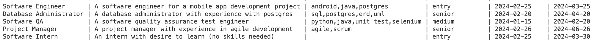
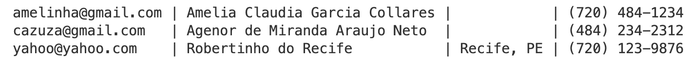

[](https://classroom.github.com/a/q8skb0tP)

# Introduction

In this project, you will design and implement a database for a fictional job site called (creatively) "Job Hunters". Additionally, you must fill your database tables with fake data for testing purposes. At the end of this project, you will use your database to answer some queries using SQL.


# Part A: Database Design

The purpose of the "Job Hunters" database is to support the hiring process and to answer analytical queries. The minimum data requirements for the database are described below:

- positions are uniquely identified by an identification number; ✅
- at a minimum, the system stores the position title, a brief description (300 characters), its creation date and expiration date (until when the position accepts candidates); ✅

- in addition, a position also has an optional list of skills expected of candidates (separated by commas); ✅

- positions are also classified into entry, middle and senior levels; ✅

- position candidates create profiles saved in the database; ✅

- information such as the candidate's email (unique attribute), name, address and telephone number need to be kept in the database; ✅

- after creating the profile, the candidate can apply for different positions as desired; ✅

- for each application for a position, the system records the date of the application and its status, using a 3-letter code: APL (“candidate”), RJT (“rejected”), SLT (“selected”), DRP (“discarded”). ") or HRD ("contractor"); ✅

- the full description of each of the above status codes must be maintained in a separate table.

Your database design should be submitted as an ER diagram in crows-foot format in a file named **job-hunters.erd**. Use the provided file template and make sure to add your name (and the name of your partner, if working in pairs) in the comments section of the file.

<!--  -->

# Part B: Database Implementation

Make sure your database implementation meets the following requirements:

- the database must be named **job_hunters**; 🔥
- all table names should have the first letter of each word capitalized; 🔥
- all table names should be in the plural form; 🔥
- all tables must have a primary key; (3 PK's 3 FK's for a PK (Applications)) 🔥
- all attribute names of a table must be in lowercase (compound words should be connected using underscore); 🔥
- foreign attributes must be renamed to improve readability; 🔥
- position id's must be auto-generated; 🔥🔥
- all of the attributes described in the previous section are required (NOT NULL??), except the **skills** attribute in positions and the **address** attribute in candidates (both nullable); 🔥
- all foreign keys must be set whenever appropriate and if a position is deleted, all candidate applications to that position must as well be automatically deleted; 🔥🔥🥴🔥🔥
- similarly, if a candidate is delete, all positions that the (deleted) candidate applied for must also be automatically deleted. 🔥🔥🥴🔥🔥

Your database implementation will be evaluated based on names used for tables and attributes, data types for attributes, primary and foreign key constraints, and nullable constraints. All of the above requirements will also be checked.

Your database must be populated with the following positions:



Your database must also be populated with the following candidates:



Feel free to add more positions and candidates if you want. But those above must be in the database.

Finally, you should have candidates applying to all but one position. Make sure that the application date is consistent with the position creation date. You should also have one of the candidates not applying to a position. 🔥🥴🔥

Your database implementation, together with all insert statements, should be submitted as an SQL script in a file named **job-hunters.sql**. Use the provided template.

# Part C: SQL Queries

Write the SQL for the following queries:

```
a) all position titles in alphabetical order

b) number of candidates (labeled as total_candidates) in the database

c) number of positions (labeled as number_positions) by classification

d) a list of all applications with the position ids, candidate names, and the status
(description) of their applications, ordered by position id and then candidate name

e) similar to d, but showing the position title too

f) number of positions per classification, order by classification and having the
number of positions column referred to as "total"

g) positions (id and title) that are still open (ie, candidates can still apply today),
order by their id.

h) a (distinct) alphabetic list of the candidates that are applying for positions

i) a (distinct) alphabetic list of the candidates that are NOT applying for positions

j) a list of all positions that require "java" as a skill

*** BONUS ***
k) the name of the candidate that applied for the most positions
```

# Rubric

```
+20 Part A (database design)
+45 Part B (database implementation)
    +25 table create statements
    +20 database insert statements
+30 Part C (SQL queries): +3 points per query
+5 bonus point (query "k")
-5 name of the students not identified in files (erd and sql)
```
