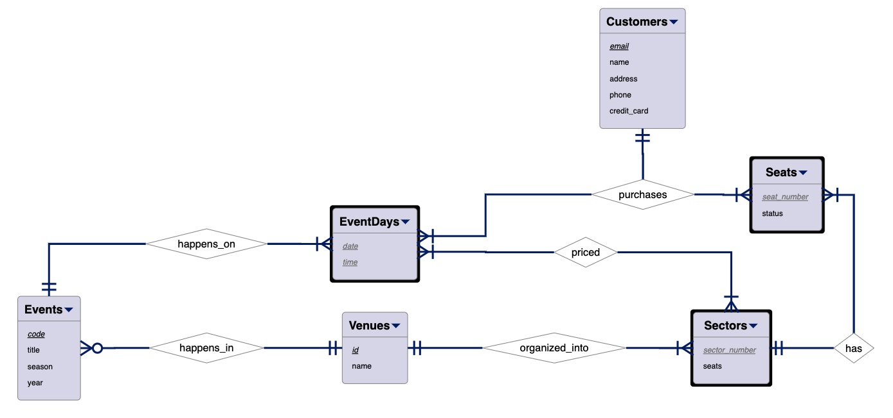

# Instructions

You were hired by an event management company in the Denver area that wants to automate its ticketing system. After meeting with the client you took the following notes:

- events are uniquely identified by a three-letter code, they have a title, and are scheduled to happen during a particular season (Fall, Winter, Spring, or Summer), at a specific year;
- the company organizes events at different venues (theaters, stadiums, etc.) uniquely identified by a venue identification number and they each have a name;
- for ticketing purposes, each event venue is divided into sectors and each sector has a number of available seats;
- for each event, all seats at a particular location belonging to a sector share the same sell price;
- customers are uniquely identified by their email, they have a name, phone, credit card, and billing address;
- a customer can book one or more seats for a particular day and time of an event.

After some thinking, you came up with the E/R Data Model [ticketing.erd](ticketing.erd).

Create a relational schema in a file named **ticketing.txt** from the given E/R data model. Make sure that your model is able to represent all entity sets, relationships, attributes, attribute domains, and keys. To represent prime attributes suffix the attribute's name with a "\*". Note that the **priced** relationship has an attribute named **price**. For the ternary relationship, just create a new relation to represent it.

<!--  -->

# Grading

-1 every 2 missing relations

-1 every 3 missing/mistake attribute in relation, including domain or key
