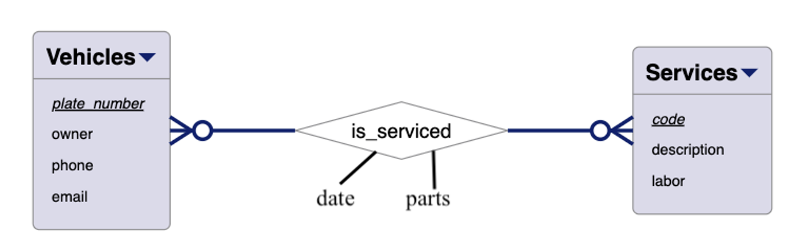
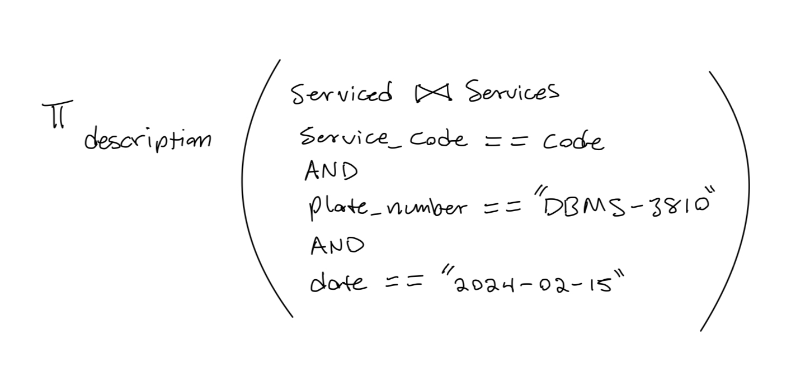

[](https://classroom.github.com/a/WwpGOev4)

# Instructions

Consider the Entity Relationship (ER) diagram that models data requirements for an automotive service store.



Consider the following:

- \*service code is just a number;
- service labor describes how many hours is projected for the service;
- parts is the cost of all parts used to service a particular vehicle.

# Part 1 (3 points)

Create a relational model from the ER one, making sure that all relations are properly identify, with primary keys and domains.

# Relational Model 🔥

```
Vehicles(plate_number*: String, owner: String, phone: String, email: String)
Services(code*: int, description: String, labor: int)
Serviced(plate_number*: String, services_code*: int, date: Date, parts: float)
```

# Part 2 (2 points) 🔥

Using **relational algebra**, create a relation with a complete description of all the services done on the vehicle identified by plate number 'DBMS-3810' on February 15, 2024.

<!--  -->



# Bonus Point (1 point)

In part 2, add another relational algebra query to display the descriptions of all services available.

# Part 2 Bonus 🔥🔥

```
π description (Services)
```
